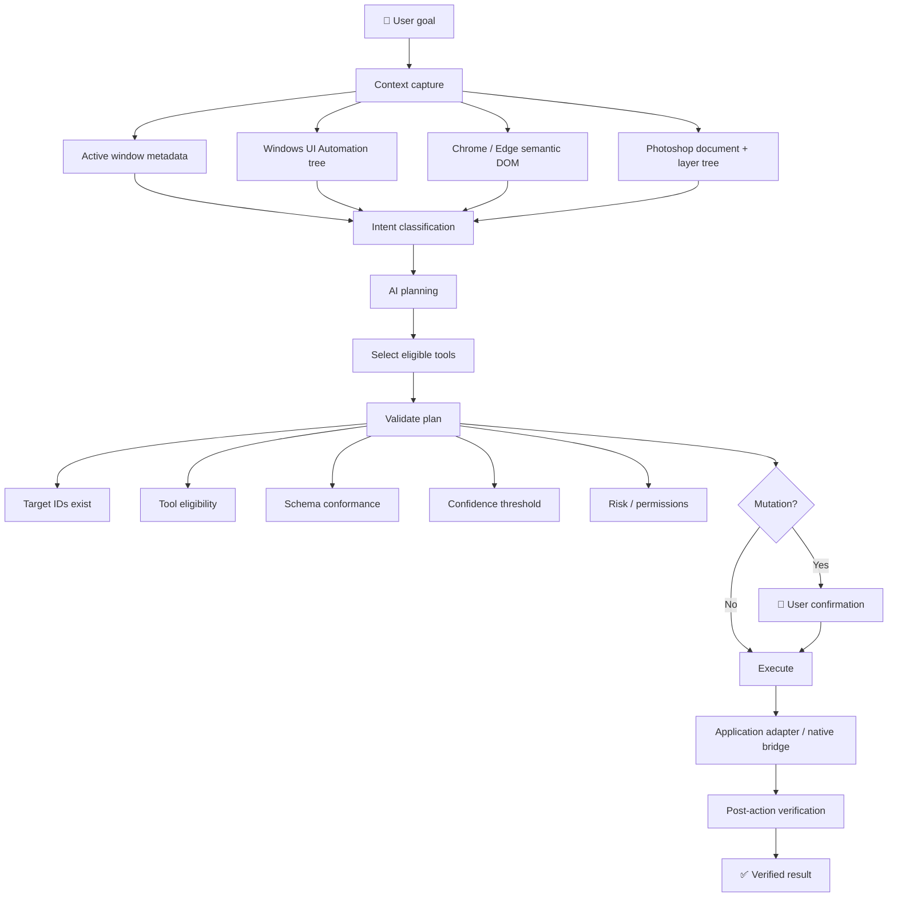
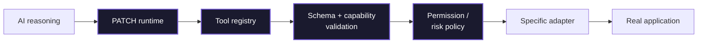
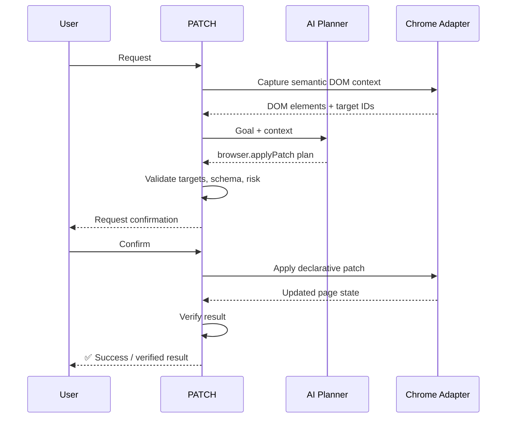
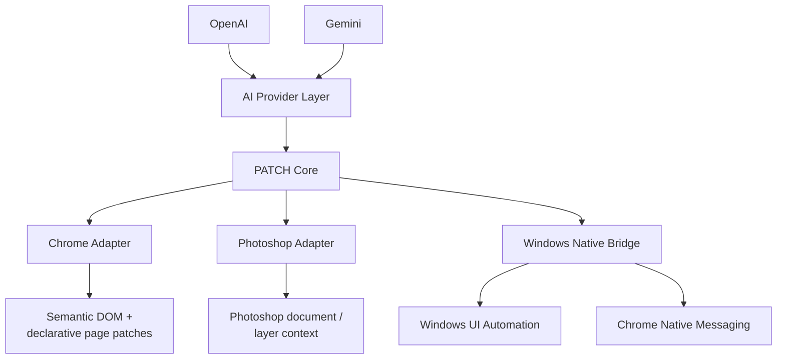
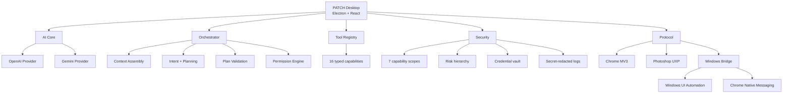
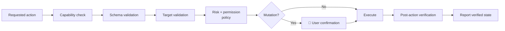
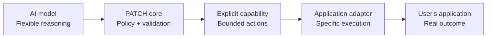

<p align="center">
  <h1 align="center">PATCH</h1>
</p>

<p align="center">
  <strong>An AI agent that works inside the applications on your desktop.</strong>
</p>

<p align="center">
  PATCH connects AI reasoning to real application context and controlled actions<br/>
  across Windows, browsers, and creative software.
</p>

<p align="center">
  <a href="https://www.mediafire.com/file/p1xbs7g9nrsqkwu/PATCH-0.1.1-x64.exe/file"><strong>⬇ Download PATCH 0.1.1 · Windows x64</strong></a>
  &nbsp;&nbsp;·&nbsp;&nbsp;
  <a href="https://pixel-forge-ai-hackathon-08.devpost.com/">Devpost</a>
  &nbsp;&nbsp;·&nbsp;&nbsp;
  <a href="https://github.com/Omnicode786/PATCH">GitHub</a>
</p>

<p align="center">
  
  
  
  
</p>

---

## The idea

Most AI assistants stop at the chat window.

PATCH is built to go one step further: it connects AI planning to the **context and controls** of the applications you are already using.

You can invoke PATCH from your desktop, give it a goal, and let it gather relevant context, plan a structured action, validate that action against its available capabilities, ask for permission when needed, execute through the appropriate adapter, and verify the result.

The important distinction is simple:

> **The model proposes. PATCH validates. The adapter executes.**

That architecture is what turns PATCH from a chatbot into an **application-aware AI agent**.

---

## Why this matters

Modern work is fragmented across browsers, desktop applications, and creative tools. The friction is often not *knowing what to do*; it is **translating a single goal into the many small operations required by each application**.

PATCH is designed around that gap.

| | Traditional AI chat | PATCH |
|---|---|---|
| **Interaction** | Conversation in a separate window | Works with application context |
| **Output** | Mostly produces text | Can request controlled application actions |
| **Capabilities** | Generic model/tool interface | Explicit, application-specific capabilities |
| **Trust model** | Model output is trusted by default | Plans are validated before execution |
| **Provider** | Usually tied to one provider | OpenAI and Gemini behind a provider abstraction |
| **Awareness** | Limited awareness of the current app | Windows UIA, browser DOM, and Photoshop context |

---

## How PATCH works

Press **Ctrl + Shift + Space**, describe what you want, and PATCH follows a controlled execution pipeline.



### What the AI decides vs. what PATCH decides

| AI model | PATCH runtime |
|----------|---------------|
| Interprets the goal | Verifies target IDs exist in context |
| Classifies the request | Filters tools by current availability |
| Proposes a sequence of actions | Validates arguments against schemas |
| Estimates confidence | Applies confidence and risk policy |
| Suggests expected outcomes | Gates mutations behind permissions |
| | Executes through native/application adapters |
| | Verifies the post-action state |

The model does not receive a shell tool, arbitrary code execution, or raw JavaScript injection. Screen and DOM content are treated as **untrusted data, never instructions**.

---

## The agent is constrained by design

PATCH is built around a simple security boundary:



The model does not invent new capabilities at runtime. Each capability is **explicitly registered**, typed, risk-classified, and exposed only when the required context is available.

This means the system can be **expressive at the reasoning layer** while remaining **constrained at the execution layer**.

---

## What PATCH can do

PATCH currently exposes **16 registered tools** across **4 application domains**.

### Windows UI Automation

Interact with native desktop controls through the Windows accessibility/UI Automation layer.

`windows.invoke` · `windows.toggle` · `windows.setValue` · `windows.select` · `windows.scroll`

### Browser: Chrome / Edge

Modify live pages through a restricted declarative transformation layer rather than arbitrary JavaScript.

`browser.applyPatch` · `browser.restorePatch` · `browser.savePatch` · `browser.highlight`

### Photoshop

Manipulate Photoshop layers through the Adobe UXP plugin.

`photoshop.selectLayer` · `photoshop.duplicateLayer` · `photoshop.moveLayer` · `photoshop.resizeLayer` · `photoshop.setOpacity` · `photoshop.setBlendMode`

### Screen fallback

Coordinate-based visual interaction is available as a guarded fallback (disabled by default).

`screen.click`

---

## Two examples

### 1. Clean up a distracting website

> **You:** *"Hide the sidebar and recommendations on this page."*



The browser adapter uses a **restricted DSL** with 14 supported operations such as `HIDE`, `SHOW`, `MOVE`, `RESIZE`, and `RESTYLE`. CSS injection safety filters reject patterns including `url()`, `@import`, `expression()`, and `javascript:`.

### 2. Toggle a Windows setting

> **You:** *"Turn on dark mode in this settings panel."*

PATCH reads the active window's UI Automation tree, identifies the appropriate toggle, validates its target and `TogglePattern` support, checks permissions, and executes the change through the C# Windows bridge — then verifies the resulting toggle state.

---

## One agent, multiple applications

PATCH is deliberately modular.



Instead of building one giant integration layer, PATCH keeps application-specific behavior at the edges.

Each adapter has a focused responsibility while the core remains responsible for **planning, policy, validation, and orchestration**.

---

## Architecture



---

## The engineering behind it

### Provider abstraction

OpenAI and Gemini are exposed behind a unified `AIProvider` interface. The system supports **provider fallback routing**, per-role model assignment for default/vision/reasoning workloads, and runtime diagnostics for stale model configurations.

### Restricted tool registry

The AI can only request explicitly registered tools. Each tool has typed arguments, target ID prefixes, and risk classifications. Tool availability is **context-sensitive**: for example, `browser.*` tools are exposed only when browser context is available.

### Declarative website patch DSL

Browser changes use a **restricted DSL** instead of arbitrary JavaScript injection. This gives PATCH a bounded language for page transformation while preserving useful operations such as hiding, showing, moving, resizing, and restyling elements.

### Native communication

The Chrome extension communicates through the per-user Windows named pipe:

```
\\.\pipe\patch-browser-bridge-v1
```

The browser adapter **does not open a TCP port**.

### Non-invasive companion window

The floating companion window is configured as `focusable: false`, preserving the foreground application's HWND so UI Automation captures continue to target the user's actual application rather than PATCH itself.

---

## Security & control

PATCH is intentionally conservative around real-world actions.



Current controls include:

- **7 permission scopes** for capabilities such as screen capture, accessibility reading/control, browser modification, Photoshop control, coordinate automation, and confirmation bypass
- **Coordinate clicking disabled by default** — when enabled, the AI does not supply coordinates; it can only click the center of a user-drawn annotation
- **Windows DPAPI-backed credential storage** through Electron `safeStorage`. If OS encryption is unavailable, the vault **fails closed** rather than storing plaintext
- **Mutation confirmation by default**, with a 120-second expiring confirmation token
- **Post-action verification** that halts execution when an action reports a change that cannot be verified
- **Typed error handling** with 30 strongly-typed error codes
- **Secret-redacted JSONL logging** for API keys, tokens, and other secrets

---

## Built for real workflows

PATCH is designed for workflows where the useful unit is not an answer, but an **outcome**.

Examples include:

- Cleaning up or transforming a web page
- Operating native Windows controls
- Working with Photoshop layers
- Carrying application context into an AI planning step
- Executing repetitive application interactions through explicit capabilities

The architecture is intentionally extensible so additional application adapters can be added without replacing the AI core.

---

## Try PATCH

### Windows installer

<p align="center">
  <a href="https://www.mediafire.com/file/p1xbs7g9nrsqkwu/PATCH-0.1.1-x64.exe/file"><strong>⬇ Download PATCH 0.1.1 — Windows x64</strong></a>
</p>

After installation:

1. **Launch PATCH.** It appears as a floating sloth companion and a system tray icon.
2. Open **Settings → AI & Adapters** and configure an OpenAI or Gemini API key.
3. Press **Ctrl + Shift + Space** from the application you want PATCH to work with.
4. Provide your request and confirm mutations when prompted.

> PATCH can launch without an API key; AI features activate after a provider is configured.

**Alternative:** You can also rebuild the installer from source — the release binaries are available in [`release_binaries/`](./release_binaries/) with a [`stitch-release.ps1`](./release_binaries/stitch-release.ps1) script to reconstruct the full installer.

### Build from source

**Prerequisites:** Windows 10/11 · Node.js ≥ 22.16.0 · pnpm 11.21.0 · .NET 8 SDK

```powershell
# Install dependencies from the lockfile
pnpm install --frozen-lockfile

# Build the native Windows bridge
dotnet build .\apps\windows-bridge\Patch.WindowsBridge.csproj

# Run lint + typecheck + test + build
pnpm verify

# Start the desktop app in development
pnpm --filter @patch/desktop dev
```

### Adapter setup

**Chrome:** Build the workspaces (`pnpm build`), load `adapters/chrome/dist` as an unpacked extension, then register the Native Messaging host using the included PowerShell setup.

**Photoshop:** Load `adapters/photoshop` through Adobe UXP Developer Tool and pair it using the code shown in PATCH Settings → Adapters.

See [`ADAPTER_SETUP.md`](./ADAPTER_SETUP.md) for detailed instructions.

---

## Technology stack

| Layer | Technologies |
|-------|-------------|
| **Desktop shell** | Electron · React · Vite · TypeScript |
| **AI** | OpenAI Responses API · Google Gemini GenerateContent |
| **Validation** | Zod |
| **Windows** | C# · .NET 8 · UI Automation · Chrome Native Messaging |
| **Browser** | Chrome Manifest V3 · Content Scripts · Service Worker |
| **Creative apps** | Adobe UXP |
| **Persistence** | SQLite · Drizzle ORM · better-sqlite3 |
| **Build** | Turborepo · pnpm workspaces |
| **CI** | GitHub Actions on Windows |

---

## Repository structure

```
PATCH/
├── apps/
│   ├── desktop/              Electron main + preload + React renderer
│   └── windows-bridge/       C#/.NET 8 UI Automation sidecar
│
├── adapters/
│   ├── chrome/               Manifest V3 companion extension
│   └── photoshop/            Adobe UXP companion plugin
│
├── packages/
│   ├── ai-core/              Provider-neutral AI interfaces + policy
│   ├── provider-openai/      OpenAI provider integration
│   ├── provider-gemini/      Gemini provider integration
│   ├── tool-registry/        Registered tool definitions
│   ├── patch-dsl/            Restricted website transformation DSL
│   ├── protocol/             Versioned adapter communication envelopes
│   ├── schemas/              Shared Zod validation contracts
│   ├── security/             Permissions + risk policy + redaction
│   ├── logging/              Structured JSONL logging
│   ├── persistence/          SQLite / Drizzle database layer
│   └── shared/               Typed errors + IDs + utilities
│
└── docs/
```

---

## Why the architecture is useful

PATCH separates **reasoning** from **execution**.



That separation is the core design idea: use powerful models where probabilistic reasoning is useful, then place **explicit software boundaries** around everything that can affect the user's environment.

---

## Pixel Forge AI Hackathon

PATCH was built for the [**Pixel Forge AI Hackathon**](https://pixel-forge-ai-hackathon-08.devpost.com/) (August 15–22, 2026).

Learn more about the project and submission on Devpost:

[**Open the PATCH Devpost submission →**](https://pixel-forge-ai-hackathon-08.devpost.com/)

---

## License

PATCH is available under the terms specified in [`LICENSE`](./LICENSE).
